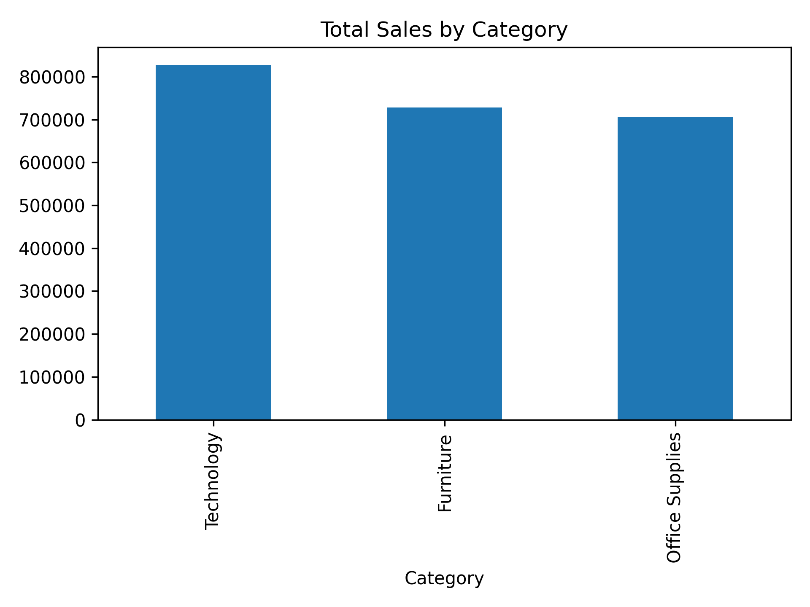
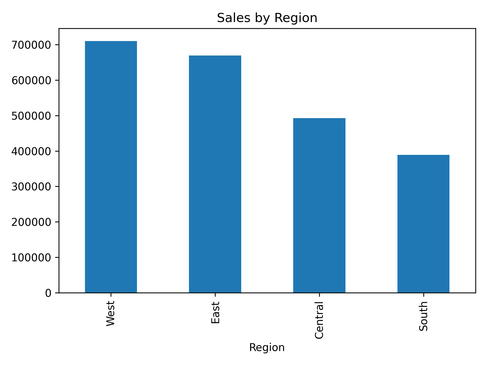
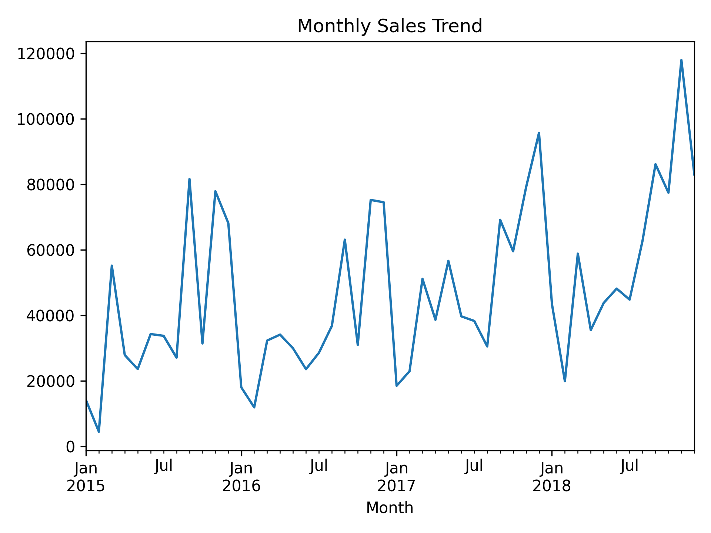
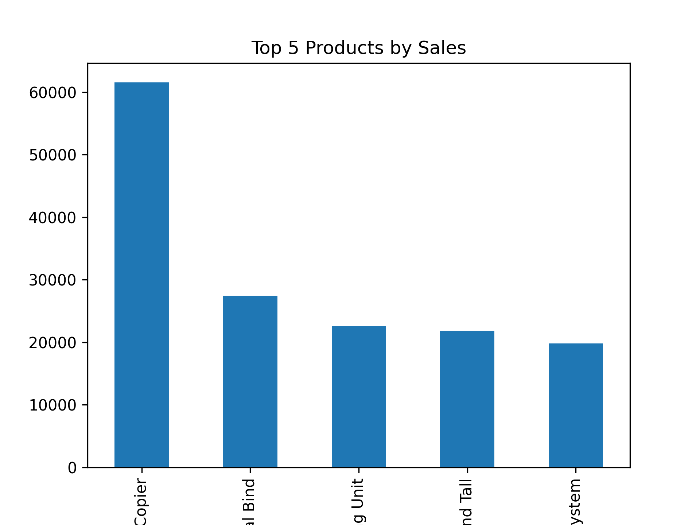
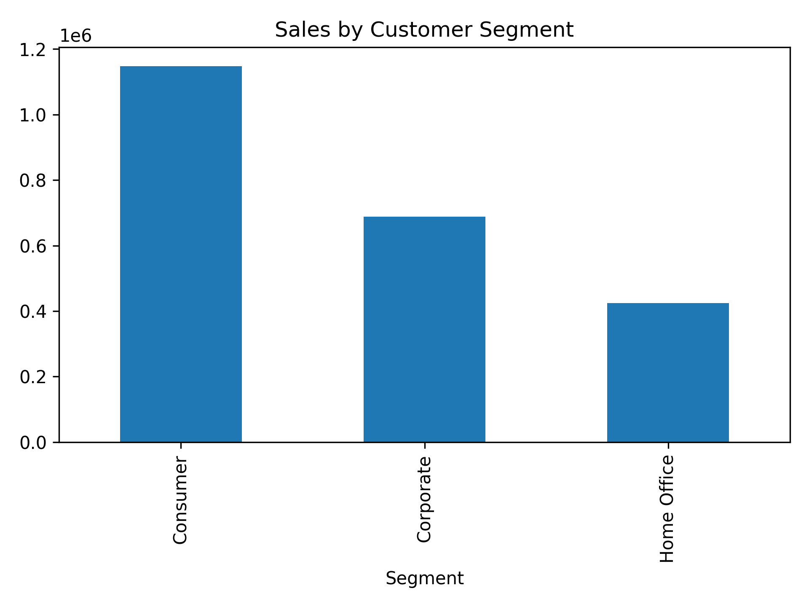

# E-commerce Sales Analysis

## 📊 Project Overview

This project analyzes e-commerce sales data using Python to understand
sales performance across categories, regions, time periods, customer
segments, and products.

The analysis focuses on data cleaning, exploratory data analysis (EDA),
aggregation, and visualization to identify meaningful patterns and
trends in the sales data.

## 🎯 Project Objective

The main objectives of this project are to:

-   Analyze overall e-commerce sales performance
-   Compare sales across different product categories
-   Analyze regional sales performance
-   Identify monthly sales trends
-   Identify the top-performing products
-   Compare sales across customer segments
-   Present findings through clear and easy-to-understand visualizations

## 🛠️ Technologies Used

-   **Python**
-   **Pandas** -- data loading, cleaning, transformation, and analysis
-   **NumPy** -- numerical operations
-   **Matplotlib** -- data visualization
-   **Seaborn** -- statistical and categorical visualization

## 📁 Project Structure

``` text
Ecommerce-Sales-Analysis/
│
├── images/
│   ├── 1_total_sales_by_category.png
│   ├── 2_sales_by_region.png
│   ├── 3_monthly_sales_trend.png
│   ├── 4_top5_products.png
│   └── 5_sales_by_segment.png
│
├── Sales.csv
├── requirement.txt
├── sales_analysis.py
├── .gitignore
└── README.md
```

## 🔍 Analysis Performed

### 1. Sales by Category

Analyzed total sales across product categories to understand
category-level performance.



### 2. Sales by Region

Compared sales across different regions to understand geographical sales
performance.



### 3. Monthly Sales Trend

Analyzed monthly sales to identify changes and trends over time.



### 4. Top 5 Products

Identified the five products with the highest sales based on the
available dataset.



### 5. Sales by Customer Segment

Compared sales across customer segments to understand the contribution
of different customer groups.



## 📌 Key Insights

The analysis provides a view of:

-   Which product categories contribute more to sales
-   How sales vary between regions
-   How sales change from month to month
-   Which products are among the top performers
-   How different customer segments contribute to overall sales

The exact findings can be explored in the generated visualizations and
the Python analysis script.

## ▶️ How to Run the Project

### 1. Clone the repository

``` bash
git clone https://github.com/renuka-tandulkar/Ecommerce-Sales-Analysis.git
```

### 2. Open the project folder

``` bash
cd Ecommerce-Sales-Analysis
```

### 3. Install the required libraries

``` bash
pip install -r requirement.txt
```

### 4. Run the analysis

``` bash
python sales_analysis.py
```

The analysis will process the sales dataset and generate the
visualizations.

## 📚 Skills Demonstrated

-   Data Analysis
-   Data Cleaning
-   Exploratory Data Analysis (EDA)
-   Data Aggregation
-   Data Visualization
-   Python Programming
-   Pandas
-   Matplotlib
-   Seaborn
-   Business-oriented sales analysis

## 👩‍💻 Author

**Renuka Tandulkar**

B.Tech Electrical Engineering | Aspiring Data Analyst

GitHub: https://github.com/renuka-tandulkar
